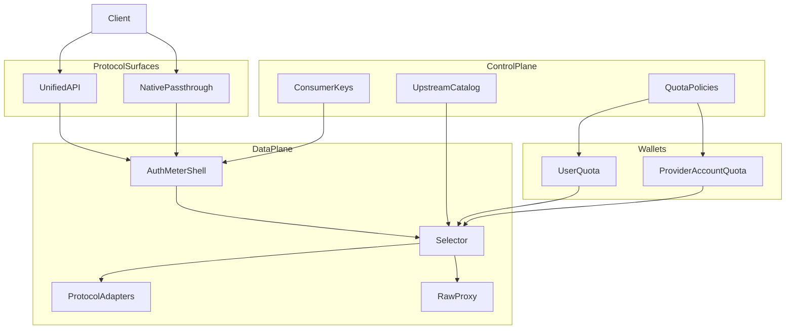

# backend 横向总结

面向 **AIAPICenter**：一平台管理多上游（官方/第三方）HTTP API；额度与耗尽自动切换；对外 **统一 API + 原生透传** 双模。

## 本层已研项目

| 仓库 | 一句话 | 利用方式 |
|------|--------|----------|
| [Wei-Shaw/sub2api](Wei-Shaw--sub2api.md) | 上游 Account 与下游 Channel 分离；粘性选号 + excludedIDs 换号 | reuse-pattern / adapt / anti-pattern |
| [QuantumNous/new-api](QuantumNous--new-api.md) | Distribute→Relay→Adaptor；预扣费；priority 跨组 failover | reuse-pattern / adapt / anti-pattern |
| [diegosouzapw/OmniRoute](diegosouzapw--OmniRoute.md) | 配额四态（unknown≠exhausted）；失败分类再 failover | reuse-pattern / adapt / anti-pattern |
| [BerriAI/litellm](BerriAI--litellm.md) | 逻辑模型组 vs deployment；统一面 + `/provider/{path}` 透传 | reuse-pattern / adapt / anti-pattern |
| [Portkey-AI/gateway](Portkey-AI--gateway.md) | tryTargetsRecursively 策略树；通配 proxy 兜底；热路径保持小 | reuse-pattern / adapt / anti-pattern |
| [apache/apisix](apache--apisix.md) | instance + fallback_strategy（429/5xx）；Route/Service/Upstream | reuse-pattern / adapt / anti-pattern |
| [Kong/kong](Kong--kong.md) | Service/Route/Upstream/Target；response-ratelimiting | reuse-pattern / adapt / lesson-only |
| [TykTechnologies/tyk](TykTechnologies--tyk.md) | Session/Policy Redis 配额账本；默认透传代理 | reuse-pattern / adapt / anti-pattern |
| [krakend/krakend-ce](krakend--krakend-ce.md) | no-op 透传 vs 多 backend 聚合；无状态需外置账本 | reuse-pattern / adapt / lesson-only |

## 共同架构经验

### 建议逻辑分层（给 AIAPICenter）

| 层 | 职责 | 主要借鉴 |
|----|------|----------|
| Protocol Surfaces | 统一门面 + 原生/透传前缀 | litellm、Portkey、KrakenD no-op、sub2api 多入口 |
| Auth / Meter 壳 | 鉴权、计量、审计；透传也走壳 | Tyk、Kong、litellm |
| Selector | 优先级/权重 + 剔除 exhausted + 粘性 + 失败换号 | OmniRoute、sub2api、new-api、APISIX ai-proxy-multi |
| Adapters vs RawProxy | 归一化变换 vs 字节级透传 | new-api Adaptor、APISIX/Kong AI vs 普通 Upstream |
| 双钱包 | 用户额度 ≠ 上游账号额度 | Tyk Session + sub2api Account/Channel + new-api billing |

### 抄什么 / 改写什么 / 不要抄什么

**建议抄（reuse-pattern）**

1. **上游凭证池 ≠ 下游产品/计费面**（sub2api Account/Channel；Kong Service 分层）。
2. **双模入口**：统一路径做适配；`/native/{provider}/...` 或 `encoding: no-op` 做透传（litellm、KrakenD、Portkey proxy）。
3. **耗尽切换触发器**：本地 remaining、上游 429/402、instance 限流标记、失败分类（OmniRoute、APISIX、sub2api excludedIDs）。
4. **用户预扣/结算** 与 **上游健康/封禁** 分状态机（new-api）。
5. **配额四态**：healthy / approaching / exhausted / unknown（OmniRoute）。

**必须改写（adapt）**

1. 从 LLM-only catalog 扩到 **任意 HTTP 上游类型注册表**（避免 ChannelType 整数 switch）。
2. Portkey 式请求级 config → **管理面持久化 upstream pool**。
3. 通用网关的 consumer 限流 → 增加 **provider account wallet** 驱动 Selector。
4. 热路径独立进程（不要 Next.js 页面进程扛代理）。

**明确不要抄（anti-pattern）**

1. Fork 任一完整仓库当产品内核。
2. 仅用 LB 权重 / target_list 表达「额度切换」。
3. 把订阅 OAuth/Cookie 抓配额、免费档灰产路径放进核心。
4. 巨石 router / 每厂商特判入口无限膨胀。
5. 无状态 GitOps 网关单独充当多租户额度中心。

## 分歧与取舍

| 议题 | 一派 | 另一派 | AIAPICenter 取舍 |
|------|------|--------|------------------|
| 运行时 | OpenResty 插件巨舰（APISIX/Kong） | 自研 Go/TS 薄网关（Tyk/Portkey/new-api） | **自研数据面 + 模式借鉴**；不绑 NGINX 全家桶 |
| 额度位置 | 消费侧 Key（Tyk） | 上游账号池（sub2api/OmniRoute） | **双钱包都要** |
| 统一协议 | 强归一 OpenAI（new-api/litellm） | 透传优先（KrakenD/Tyk） | **双模并列**，第一版就保留透传 |
| 切换策略 | 静态 fallback 列表（Portkey） | 动态配额感知（OmniRoute/APISIX） | **动态感知为主**，静态列表作兜底 |
| 扩展 | 整数枚举 Adaptor | 注册表/插件 | **注册表** |

## 对本知识库规则的候选修订

只记录建议，不自动改 `instructions/rules/`：

- `by-type/backend`：可补「多上游网关：双钱包、双模入口、Selector 与 Adapter 边界」短规则（待用户确认）。
- `llm-app`：注明 LLM 网关调研主归档在 `backend`，本层仅 `also_relevant` 回链。

## 入选与落选备忘

**入选（9）**：用户指定 sub2api、new-api、OmniRoute；补 litellm、Portkey（LLM 双模/策略）；APISIX、Kong、Tyk、KrakenD（通用 API 管理/透传/配额）。

**代表性未深读/落选**：`songquanpeng/one-api`（与 new-api 结构过近）；`Helicone/helicone`（偏观测）；`gravitee-io/gravitee-api-management`（与 APISIX/Kong 档重复）。若后续要补「API 全生命周期管理面」，可再研 Gravitee。
