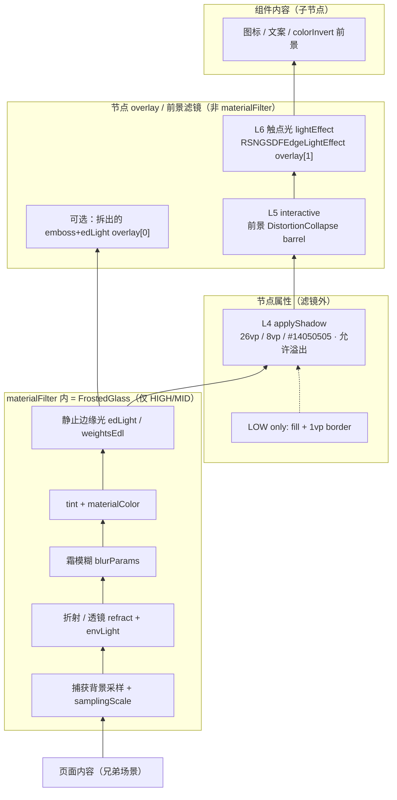

# HarmonyOS 沉浸光感分层（材质本身 + 组件叠法）

主题笔记，不是单仓库赏析。引擎证据见 [openharmony--arkui_ace_engine-immersive.md](./openharmony--arkui_ace_engine-immersive.md)。平台标签：HarmonyOS；能力层：ui-kit。

## 入选理由

YoUI 的 `ImmersiveRecipe` / `Plate.PILL|VEIL|FLUSH` 必须按**官方层所有权**接线，而不是按观感猜。本笔记回答：滤镜里有什么、overlay 有什么、HdsTabs 自己叠什么、哪一层允许溢出。

## 1. 官方层从下到上（ImmersiveMaterial 本身）

两条正交轴：

| 轴 | 枚举 | 谁定 |
|----|------|------|
| 算力档 | HIGH=`EXQUISITE` / MID=`GENTLE` / LOW=`SMOOTH` | 设备，`getGlobalMaterialLevel` / `hdsMaterial.getSystemMaterialTypes` |
| 用户强度 | 强 / 均衡 / 弱 → LUT `transparency` THIN/NORMAL/THICK | 系统设置；style 五档 ULTRA_THIN…ULTRA_THICK 再映射 |



ASCII（绘制顺序，底→顶）：

```text
页面内容
  └─ L0 捕获（HIGH/MID 采样兄弟场景；LOW 不采样）
       └─ materialFilter 内
            Lr 折射/透镜
            L1 霜模糊
            L2 bg tint + materialColor
            L3 静止 edLight          ← 不是 border
       └─ 节点
            LOW: fill + 1vp border   ← 只替代滤镜高光
            L4 shadow（溢出 clip）
            L5 interactive 前景形变
            overlay[0] 拆出的 emboss/edLight（可选）
            overlay[1] lightEffect 触点光
            内容（图标文案）
```

| 层 | 住哪 | HIGH | MID | LOW |
|----|------|------|-----|-----|
| L0 捕获 | 滤镜采样 | 开 | 开 | **关** |
| Lr 折射 | materialFilter | 开（闭源更满） | 开，开源 LUT `refractParams` 常空 | 关 |
| L1 霜 | materialFilter | 开 | 开 | 关 |
| L2 tint | 滤镜内 / LOW 当 fill | 滤镜叠色 | 同左 | **backgroundColor** |
| L3 静止 rim | materialFilter edLight | 开（强档最亮） | 开；弱档 LUT 常空 edLight | **无**；用 1vp border 顶替 |
| L4 阴影 | 节点 shadow | 默认开 | 默认开 | **仍开** |
| L5 interactive | 前景滤镜 | barrel | 有（官方全档生效） | 官方全档生效 |
| L6 lightEffect | overlay shader | 跟手 SDF 光 | 有 | 官方称全档生效；开源 config 对 SMOOTH **丢掉** lightEffectOptions |
| 空间弹出流光 | 组件/引擎 | 仅 HIGH | 关 | 关 |
| colorInvert | 前景资源色 | 仅薄 style | 同左 | **关** |

HIGH/MID：`borderWidth` 被**恢复为无边框**。LOW：走边框，因为没有滤镜高光。弱档（用户设置）在设计指南里「收敛光彩、偏高对比」；在 HIGH 设备上仍可能有滤镜，只是 edLight/折射变空，与算力 LOW 不是同一条短路。

## 2. 组件里怎么叠（HdsTabs / Navigation / Button）

### HdsTabs FLOATING（胶囊 + 蒙层）

设计：底部悬浮用 **THIN** 材质 + **渐变颜色蒙层** 延展内容。HDS 不把蒙层做进 ImmersiveMaterial。

```text
TabContent 页面
  └─ gradientMask / barBackgroundStyle     【组件自己的】Plate.VEIL
        全宽；默认高 = 栏高+16vp；浅 #CCF1F3F5 / 深 #99000000
        clip：HdsTabs 容器（跟栏一起离场）
        无 ImmersiveMaterial、无 applyShadow、无 lightEffect、无 rim
  └─ 悬浮胶囊 PILL                          【systemMaterialEffect → 系统 ImmersiveMaterial】
        clip：胶囊圆角（材质、霜、tint、edLight、内容）
        溢出：L4 阴影；L5 形变；L6 触点光外晕；bleed 图标
        项图标/文案 = 胶囊内容层，不是滤镜
```

| 配置 | 属于哪一层 | clip / 溢出 |
|------|------------|-------------|
| `gradientMask` | 组件 VEIL 蒙层，**不是** materialFilter | clip 在 Tabs 槽；高度不可为 0 |
| `barBackgroundStyle` | 平铺 overlap 的渐变模糊 VEIL | 同左；与 FLOATING 的 gradientMask 是同一类背板 |
| PILL `systemMaterialEffect` | 整条 ImmersiveMaterial（L0–L4 + 系统默认 interactive/light） | 霜/tint/edLight clip 在胶囊；阴影溢出 |
| `applyShadow` | HDS **不暴露**；材质对象默认 true | 溢出胶囊 clip |
| `lightColor` | **L6 光效颜色**，不是静止 rim | 浅 `#33FFFFFF` / 深 `#33E5E5E5` |
| `lightEffect` | HDS 不暴露；由系统按组件行为决定 | overlay，可微溢出 |
| 项图标 | 内容层 | 默认 clip 在项；`bleedIconStyle` 允许溢出栏 |

`barOverlap(true)` 才能让胶囊叠在内容上。`systemMaterialEffect` 默认 `undefined` = **没有新材质**；要玻璃必须显式传对象。

### HdsNavigation

两套东西，不要焊成一块玻璃：

| 部位 | 机制 |
|------|------|
| 标题栏背板 | `scrollEffectType`：`GRADIENT_BLUR` / `IMMERSIVE_GRADIENT_BLUR` / `COMMON_BLUR` — **组件 VEIL**，随滚动 | 
| 标题栏按钮 | `titleBar.style.systemMaterialEffect` — 每个按钮一块 **ULTRA_THIN 级** ImmersiveMaterial |
| 工具栏 | 另设 `BarStyle.STACK` + 模糊；不是 ImmersiveMaterial 默认 |

设计：顶部悬浮推荐 **ULTRA_THIN** + 渐变模糊。

### Button / 自定义控件

```text
.backgroundColor(Color.Transparent)     // 不透明会盖住材质
.borderRadius(...)
.systemMaterial(new ImmersiveMaterial({
  style, materialColor?, colorInvert?,
  applyShadow?, interactive?, lightEffect?
}))   // 必须放在其他样式之后
```

弹窗类走 options 里的 `systemMaterial`（Toast/Popup/Sheet/Menu），不必管顺序。ENABLE 模式下 Dialog/Select 等会默认开；冲突属性（实色、backgroundBlur、shadow）会挡住默认开启。

官方样本 `MaterialUtil`：按钮 ULTRA_THIN + `interactive` + `lightEffect:{color:undefined}`；菜单/Dialog THICK。先查 `hdsMaterial.getSystemMaterialTypes().length` 再挂。

## 3. HIGH vs MID vs LOW

| 关掉什么 | HIGH | MID | LOW |
|----------|------|-----|-----|
| materialFilter 整管线 | 完整（闭源滤镜优先，失败用开源 LUT） | 开源 LUT（与 HIGH 开源表相同） | **整段不建** |
| 静止 edLight | 强档有；弱档 LUT 常空 | 同左 | 无 → 1vp border |
| 折射 | 闭源更强 | 开源 `refractParams` 多为空 | 无 |
| 空间弹出流光 | 有 | 无 | 无 |
| 阴影 | 有 | 有 | **有** |
| 应用 style 五档 | 有效 | 有效 | **无效** |
| colorInvert | 薄材质可能 | 同左 | 否 |

LOW 是 fill+1vp+shadow、没有滤镜高光，因为引擎在 SMOOTH **不创建 FrostedGlass**。边框是低算力对「边缘可读」的替代，不是 HIGH 玻璃上的 rim。

社区文里的 `MaterialType.BACKGROUND_BLUR` **不在** 当前官方 `hdsMaterial` 枚举（只有 NONE / ADAPTIVE / IMMERSIVE）。降级请用：无 IMMERSIVE → `MaterialLevel.SMOOTH`，不要发明第四种 Type。

## 4. 两种接入模式

```text
HdsTabs / HdsNavigation
  只传 systemMaterialEffect: { materialType, materialLevel }
  HDS 闭源内部映射成 ImmersiveMaterial（厚度、interactive、lightEffect、阴影全是系统默认）
  应用禁止再给胶囊叠 backgroundBlur / 实色 / 自绘 rim

自定义控件
  new uiMaterial.ImmersiveMaterial(ImmersiveOptions)
  .systemMaterial(...)
  Native：OH_ArkUI_NativeModule_ImmersiveMaterial_Create + NODE_SYSTEM_MATERIAL
```

HDS 的 `ADAPTIVE` type「默认为沉浸式材质」。`getSystemMaterialTypes()` 不含 IMMERSIVE 时不要强上 EXQUISITE。

## 5. 对 YoUI ImmersiveRecipe / Plate 的对照

| 官方层 | YoUI 已有 | 接错 / 应对齐 |
|--------|-----------|----------------|
| L0 捕获 | BackdropHost，overlay 排除 | 保持；VEIL 要 `liftSample` |
| L1 霜 + LUT | ImmersiveLut 已吃开源 blurParams | HIGH 仍是自研近似，勿声称闭源 FrostedGlass |
| L2 tint | tone + materialColor | LOW 用 `recipeFillColor`，不要继续走滤镜半径 |
| L3 静止 rim | LUT edLight；HIGH Fresnel | **不要把 `HdsTabs.lightColor` 当静止 rim 峰值色**。lightColor = L6。L3 是滤镜环境光，无独立「栏光色」API |
| L4 阴影 | PILL 26/8/`#14050505` | VEIL/FLUSH 关阴影 = 正确 |
| L5 interactive | HIGH barrel / MID scale | 与 YoClickEffect 互斥，保持 |
| L6 lightEffect | FLOATING 已开；色 `BAR_LIGHT_COLOR_*` | 色值应对齐 lightColor，且 **只喂 L6**，不要同时当 L3 rim |
| Plate.PILL | FLOATING 胶囊 | 唯一挂 ImmersiveMaterial 的板 |
| Plate.VEIL | gradientMask / barBackgroundStyle | 组件蒙层，不是第二块 ImmersiveMaterial |
| Plate.FLUSH | TILED 贴底 | 无渐变、无 rim、无阴影 |
| Navigation 按钮 | CONTROL/ULTRA_THIN | 材质挂在按钮，不要挂整条 title VEIL |
| LOW 1vp border | 文档已规划 PILL/DEFAULT | VEIL/FLUSH 永不描边；HIGH/MID 保持 0 |

**明确反模式：** 一层 Canvas 同时画霜、rim、触点光、蒙层；给 VEIL 加胶囊阴影；HIGH 画发丝边；把 `lightColor` 画成 360° 白线圈。

## 闭源缺口

- `system/lib64/libhdsmaterialimpl.z.so`：`SetMaterial`、EXQUISITE 真滤镜、LOW 填色/1vp 色值、`GetEnableColorInvert`
- Rosen `RSNGFrostedGlassFilter` 着色器正文
- `@kit.UIDesignKit` HdsTabs/HdsNavigation 源码（如何把 `systemMaterialEffect` 编成 ImmersiveMaterial、胶囊 clip、lightColor 接线）
- 强档粒子 / 空间弹出形变曲线
- 官方 `hdsMaterial` 是否内部仍有 BACKGROUND_BLUR（公开枚举没有）

## 阅读范围

官方：设计《沉浸光感》、`arkts-immersive-light-sense`、FAQ、`uiMaterial`、`native_material.h`、`hdsMaterial`、`HdsTabs` / `HdsNavigation`、UI Design Kit 沉浸光感、最佳实践《沉浸光感》。

源码：ace_engine 材质编译与 overlay（见姊妹篇）；Spatialization `MaterialUtil.ets`；UXExamples `HdsUtil.ets`（标题栏只传 ADAPTIVE 对象）。

未读：HDS 闭源组件、霜玻璃 GPU 内核。
